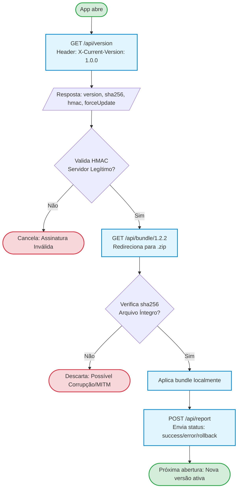

# server-OTA

[](https://nextjs.org/)
[](https://vercel.com/)
[](https://capacitorjs.com/)

Servidor de distribuição de atualizações **Over-The-Air (OTA)** para aplicativos híbridos, construído com Next.js 15. Ele atua como o *backend* de infraestrutura para fornecer pacotes web dinâmicos sem a necessidade de passar pelas esteiras de revisão das App Stores.

🔗 **App Mobile Cliente:** [FranciscoWallison/app-OTA](https://github.com/FranciscoWallison/app-OTA)

---

## Arquitetura e Fluxo de Atualização

A comunicação entre o aplicativo móvel e este servidor foi desenhada com foco em **Security by Design**, garantindo a integridade e a autenticidade de cada pacote distribuído.



---

## Segurança

O servidor implementa duas camadas principais de proteção:

1. **Autenticidade (HMAC-SHA256):** Cada resposta do `/api/version` inclui uma assinatura HMAC calculada sobre `{version}:{sha256}:{minVersion}:{timestamp}`. O app valida essa assinatura usando uma chave simétrica, garantindo que a resposta não foi adulterada por terceiros (Man-in-the-Middle).
2. **Integridade (SHA-256):** O arquivo `.zip` possui um hash criptográfico próprio. Após o download, o cliente recalcula o hash e o compara com a informação enviada pelo servidor antes de extrair os arquivos.

---

## Endpoints da API

Todas as rotas `/api/*` possuem suporte a **CORS (`*`)**, requisito fundamental para consumo a partir de WebViews de apps mobile.

### `GET /api/version`

Consulta a versão mais recente em produção.

**Headers:** `X-Current-Version: 1.0.0` (opcional)

**Response (200 OK):**
```json
{
  "version": "1.2.2",
  "sha256": "80a8560caea234c35f...",
  "hmac": "assinatura-hmac-sha256",
  "minVersion": "1.0.0",
  "forceUpdate": false,
  "size": 213619,
  "timestamp": "2026-03-03T12:00:00.000Z"
}
```

### `GET /api/bundle/:version`

Endpoint de download. Realiza o redirecionamento para o artefato estático com cache imutável de 1 ano.

Exemplo: `GET /api/bundle/1.2.2` → redireciona para `/bundles/bundle-1.2.2.zip`

### `POST /api/report`

Endpoint de telemetria. Recebe o resultado da aplicação do bundle no cliente.

**Payload:**
```json
{
  "status": "success",
  "version": "1.2.2",
  "currentVersion": "1.1.0",
  "platform": "android",
  "timestamp": "2026-03-03T12:00:00.000Z"
}
```

| `status` | Descrição |
|----------|-----------|
| `success` | Atualização aplicada com sucesso |
| `rollback` | App reverteu para versão anterior |
| `error` | Falha ao aplicar a atualização |

### `GET /api/health`

Health check do servidor.

```json
{ "status": "ok", "timestamp": "2026-03-03T12:00:00.000Z" }
```

---

## Dashboard Administrativo

Acesse a rota `/dashboard` para monitoramento:

- Controle de **Versão Atual** e **Versão Mínima** tolerada
- Lista histórica de bundles publicados (tamanho e hash)
- Logs de telemetria: taxa de adoção e rollbacks dos dispositivos conectados

> **Nota:** Os relatórios são armazenados em memória (máx. 100 entradas) e se perdem ao reiniciar o servidor. Na Vercel, isso ocorre a cada novo deploy ou cold start.

---

## Manifest

O arquivo `public/bundles/manifest.json` controla quais versões estão disponíveis:

```json
{
  "currentVersion": "1.2.2",
  "minVersion": "1.0.0",
  "versions": [
    {
      "version": "1.2.2",
      "sha256": "80a8560caea234c35f...",
      "size": 213619,
      "createdAt": "2026-03-03T11:57:02.000Z"
    }
  ]
}
```

| Campo | Descrição |
|-------|-----------|
| `currentVersion` | Versão que o servidor entrega por padrão |
| `minVersion` | Abaixo desta versão, o app é forçado a atualizar (`forceUpdate: true`) |
| `versions` | Lista de todos os bundles disponíveis |

---

## Como Executar

### Pré-requisitos (Variáveis de Ambiente)

Copie o `.env.example` e configure o segredo criptográfico:

```bash
cp .env.example .env
# Gere uma chave segura com:
openssl rand -hex 32
```

| Variável | Obrigatória | Descrição |
|----------|-------------|-----------|
| `HMAC_SECRET` | **Sim** | Segredo para assinar respostas HMAC-SHA256 |

### Desenvolvimento Local

**Opção 1: Docker (Recomendado)**
```bash
docker-compose up
```

**Opção 2: Node.js nativo**
```bash
npm install
npm run dev
```

O servidor estará disponível em `http://localhost:3000`.

### Deploy na Vercel

A arquitetura é otimizada para implantação serverless.

1. Faça o fork deste repositório
2. Importe o projeto no painel da [Vercel](https://vercel.com)
3. Configure a variável `HMAC_SECRET` nas configurações do projeto
4. Finalize o deploy — a Vercel configurará os headers de cache automaticamente via `vercel.json`

---

## Como Publicar um Novo Bundle

Para distribuir uma nova versão sem passar pela loja:

1. Gere a build no [app-OTA](https://github.com/FranciscoWallison/app-OTA):
   ```bash
   npm run build && npx cap copy
   ```
2. Compacte a pasta `www/` em `.zip` e renomeie para `bundle-X.X.X.zip`
3. Mova para `public/bundles/`
4. Atualize o `public/bundles/manifest.json` com a nova versão
5. Faça commit e push — a Vercel fará o deploy automaticamente

---

## Estrutura do Projeto

```text
server-OTA/
├── app/
│   ├── api/
│   │   ├── health/route.ts       # Health check
│   │   ├── version/route.ts      # Verificação de versão
│   │   ├── bundle/[version]/     # Download de bundle
│   │   └── report/route.ts       # Relatórios de dispositivos
│   ├── dashboard/page.tsx        # Painel de controle
│   ├── layout.tsx
│   └── page.tsx                  # Redireciona para /dashboard
├── lib/
│   ├── manifest.ts               # Leitura do manifest.json
│   ├── hmac.ts                   # Geração de assinatura HMAC
│   ├── version.ts                # Comparação de versões semânticas
│   └── reports.ts                # Armazenamento de relatórios
├── public/
│   └── bundles/
│       ├── manifest.json         # Controle de versões
│       └── bundle-X.X.X.zip     # Arquivos de bundle
├── vercel.json                   # Headers de cache e CORS
└── docker-compose.yml            # Ambiente de desenvolvimento
```

---

## Projetos Relacionados

- **App mobile:** [FranciscoWallison/app-OTA](https://github.com/FranciscoWallison/app-OTA) — app Ionic/Capacitor que consome este servidor
